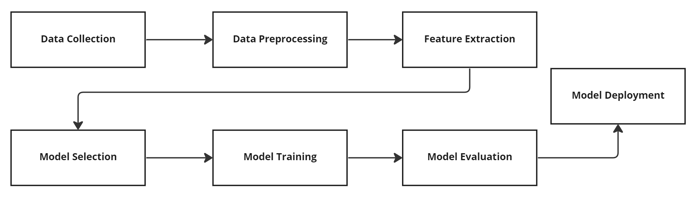

# EN_RU Deep Lexical Association Model

### **Russian/English** Words association by neural network

### **Introduction**

Learning a new language is not an easy task; it requires a lot of effort and time to achieve fluency. One of the techniques used to enhance vocabulary and improve language skills is word association. Word association is the process of connecting a new word with a familiar one to facilitate memorization and retrieval.

Word association has several benefits for language learners. Firstly, it allows learners to create personal connections between new words and familiar ones. This makes the learning process more meaningful, and the learner is more likely to remember the new word. Secondly, word association can help learners learn new vocabulary in context. By associating new words with familiar ones, learners can create mental pictures that help them remember the meaning of the new words. Thirdly, word association can help learners learn words faster. When words are associated with familiar ones, the learning process becomes more efficient.

Although the study of semantic and Lexical similarity across languages is not a new topic and many researchers have taken up this topic and presented good results, in this paper, we try to build on their findings by using the lexical similarity data set across languages to build a cross-language word association model through a machine learning neural network.

We suggest using machine learning to extract lexical patterns across languages and recommend cross-associations between words, these patterns that the human brain cannot recognize to find the association.

Then use these lexical patterns to analyze the words data set and divide it into segments according to the percentage of similarities between words.

### **Theory**

Artificial intelligence has three main branches Machine learning (ML) , Computer Vision, Natural Language Processing.
Building Words association model falls into natural language processing (NLP) branch.
Natural Language Processing (NLP) models are machine learning models that are trained to understand and generate human language. These models are designed to analyze, understand, and generate natural language, which is the language used by humans to communicate with each other.

There are several types of NLP models, which are as follows:

Rule-Based Models: Rule-based models are designed based on predefined rules and patterns. These models work by applying a set of pre-defined rules to the input text to identify patterns and extract meaning.

Statistical Models: Statistical models are based on statistical algorithms and techniques. These models are trained on a large corpus of data to identify patterns and generate language based on the probability of certain words and phrases occurring.

Neural Network Models: Neural network models are a type of machine learning model that uses deep learning algorithms to process and analyze natural language. These models are trained on large datasets and can identify complex patterns and relationships between words and phrases.

Transformer Models: Transformer models are a type of neural network model that is designed to process sequences of data, such as sentences or paragraphs. These models use attention mechanisms to identify important words and phrases in the input text, making them highly effective at generating and understanding natural language.

NLP models can be used for a variety of applications, such as language translation, sentiment analysis, chatbots, and speech recognition. These models can significantly improve human-machine interaction by enabling machines to understand and generate natural language, making them an essential component of modern technology.

_**The main process of building Natural Language Processing (NLP) models**_

* **Data Collection:** Collecting a sufficient amount of data for sentiment analysis is essential for creating a robust model. There are several sources for collecting text data, such as social media platforms, review websites, news articles, and surveys.

* **Data Preprocessing:** Once the data has been collected, it is essential to preprocess the data to clean it, remove any unwanted or irrelevant information, and convert it into a format that is suitable for analysis. This step includes tasks such as text cleaning, tokenization, and stemming or lemmatization.

* **Feature Extraction:** The next step is to extract features from the preprocessed data, which includes converting the text into a numerical representation that the model can understand. There are several methods for feature extraction, such as bag-of-words, TF-IDF, and word embeddings.

* **Model Selection:** Main types of NLP Models is Network Models and   Transformer Models, The choice of model depends on several factors such as the size of the dataset, the complexity of the problem, and the resources available.

* **Model Training:** Once the model has been selected, it is time to train the model on the preprocessed and feature-extracted data. This step involves splitting the data into training and testing sets, and then using the training set to train the model and the testing set to evaluate its performance.

* **Model Evaluation:** After the model has been trained, it is essential to evaluate its performance on the testing set. There are several evaluation metrics available, such as accuracy, precision, recall, and F1-score, which can be used to measure the performance of the model.

* **Model Deployment:** Once the model has been trained and evaluated, it is ready to be deployed for use. 

While our research case differs from the example presented because our machine learning model aims to identify letter patterns and relationships in words across multiple languages that have lexical similarities, rather than detect patterns and relationships in sentence structures, many features of the language processing model remain applicable. on our situation.